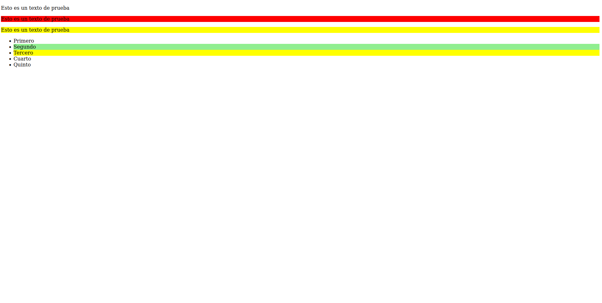

# Diferencias entre nth-child y nth-of-type

- **nth-child:** Selecciona elementos según su posición general como elemento hijo. Si hacemos nth-child(1n) va a seleccionar los hijos impares.
- **nth-of-type:** Selecciona elementos según su posición entre elementos del mismo tipo dentro del padre. Si ponemos por ejemplo nth-of-type(1n) va a seleccionar los elementos impares del mismo tipo.

Viendo primero esta página web en la que usamos nth-child.

La propiedad nth-child siempre va a seleccionar los hijos indicados, omitiendo las etiquetas que no coinciden con la colocada en el apartado _style_.

Ahora reemplazamos nth-child con nth-of-type.

En este caso, podemos observar como nth-of-type toma los hijos a partir de los tipos indicados; no a partir del elemento padre.

[html de nth-child](./nth-child.html)
[html de nth-of-type](./nth-of-type.html)
